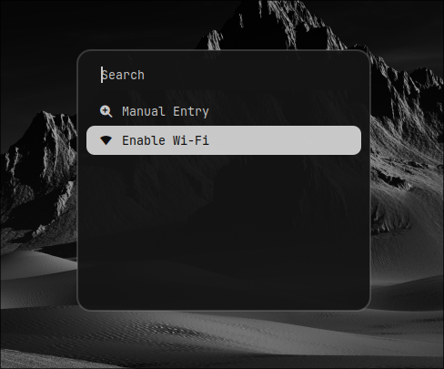

# Dotfiles


## Навигация

- [Hyprland](#hyprland)
  - [Hyprpaper](#hyprpaper)
  - [Hyprlock](#hyprlock)
- [Waybar](#waybar)
- [Rofi](#rofi)
- [Wlogout](#wlogout)
- [Терминал](#терминал)
- [Дополнительные пакеты](#дополнительные-пакеты)

## Hyprland

Оконный менеджер (WM)

- [[Основной конфиг](./Configs/hypr/hyprland.conf)]
- [[Бинды](./Configs/hypr/keybindings.conf)]
- [[Плагины](./Configs/hypr/plugins.conf)]

```
sudo pacman -S hyprland hyprpaper hyprlock
```

### Hypridle

Поведение при бездействии [[конфиг](./Configs/hypr/hypridle.conf)]

```
sudo pacman -S hypridle
```


| Действие          | Таймаут   |
| ----------------- | --------- |
| Снижение яркости  | 5 мин.    |
| Блокировка экрана | 10 мин.   |
| Выключение экрана | 10.2 мин. |
| Спящий режим      | 20 мин.   |

### Hyprpaper

Установка обоев [[конфиг](./Configs/hypr/hyprpaper.conf)]

### Hyprlock

Блокировка экрана [[конфиг](./Configs/hypr/hyprlock.conf)]

<details><summary><b>Скриншот</b></summary>


</details>

## Waybar

Wayland бар [[конфиг](./Configs/waybar/)]

```
sudo pacman -S waybar
```

<details><summary><b>Скриншот</b></summary>


</details>

## Rofi

Запуск приложений, интерфейс для буфера обмена и Wi-Fi [[конфиг](./Configs/rofi/)]

```
sudo pacman -S rofi networkmanager wl-clipboard cliphist
```

<details><summary><b>Скриншот (Лаунчер приложений)</b></summary>


</details>

<details><summary><b>Скриншот (Буфер обмена)</b></summary>


</details>

<details><summary><b>Скриншот (Wi-Fi)</b></summary>



</details>

## Wlogout

Блокировка экрана, выход, перезагрузка, выключение и т.д. [[конфиг](./Configs/wlogout/)]

<details><summary><b>Скриншот</b></summary>


</details>

## Терминал

Эмулятор терминала - [Kitty](https://sw.kovidgoyal.net/kitty) [[конфиг](./Configs/kitty/)]

Оболочка - [Zsh](https://www.zsh.org/) [[конфиг](./Configs/.zshrc)]

Расширение для Zsh - [Oh My Zsh](https://github.com/ohmyzsh/ohmyzsh)

Тема - [powerlevel10k](https://github.com/romkatv/powerlevel10k) [[конфиг](./Configs/.p10k.zsh)]

<details><summary><b>Скриншот</b></summary>


</details><br>

Установка kitty и zsh

```
sudo pacman -S kitty zsh
```

Установка Oh My Zsh

```
sh -c "$(curl -fsSL https://raw.githubusercontent.com/ohmyzsh/ohmyzsh/master/tools/install.sh)"
```

Установка темы powerlevel10k

```
git clone --depth=1 https://github.com/romkatv/powerlevel10k.git ${ZSH_CUSTOM:-$HOME/.oh-my-zsh/custom}/themes/powerlevel10k
```

Установка плагинов для zsh через Oh My Zsh:

- [zsh-syntax-highlighting](https://github.com/zsh-users/zsh-syntax-highlighting)

```
git clone https://github.com/zsh-users/zsh-syntax-highlighting.git ${ZSH_CUSTOM:-~/.oh-my-zsh/custom}/plugins/zsh-syntax-highlighting
```

- [zsh-autosuggestions](https://github.com/zsh-users/zsh-autosuggestions)

```
git clone https://github.com/zsh-users/zsh-autosuggestions ${ZSH_CUSTOM:-~/.oh-my-zsh/custom}/plugins/zsh-autosuggestions
```

Установка [exa](https://github.com/ogham/exa) (замена ls)

```
sudo pacman -S exa
```

Установка [The F*ck](https://github.com/nvbn/thefuck) (корректировщик предыдущих команд в терминале)

```
sudo pacman -S thefuck
```

## Fastfetch

В объяснении не нуждается [[конфиг](./Configs/fastfetch/)]

<details><summary><b>Скриншот</b></summary>


</details><br>

## Дополнительные пакеты

Управления яркостью экрана - [brightnessctl](https://github.com/Hummer12007/brightnessctl)

Копирование изображения в буфер обмена - [xdg-utils](https://archlinux.org/packages/?name=xdg-utils)
