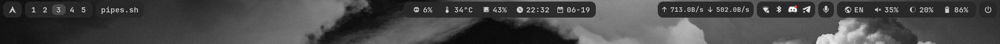
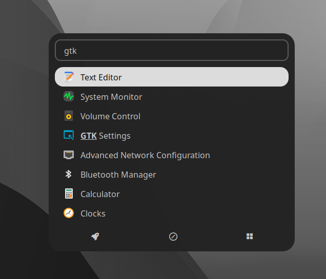

# Dotfiles

<details><summary><b>Скриншот</b></summary>


</details>

## Навигация
- [Hyprland](#hyprland)
    - [Hyprpaper](#hyprpaper)
    - [Hyprlock](#hyprlock)
- [Waybar](#waybar)
- [Rofi](#rofi)


## Hyprland (Оконный менеджер) [[конфиги](./Configs/hypr/)]

```
sudo pacman -S hyprland hyprpaper hyprlock
```

- [[Основной конфиг](./Configs/hypr/hyprland.conf)]
- [[Бинды](./Configs/hypr/keybindings.conf)]


### Hyprpaper (Установка обоев) [[конфиг](./Configs/hypr/hyprpaper.conf)]

### Hyprlock (Блокировка экрана) [[конфиг](./Configs/hypr/hyprlock.conf)]

<details><summary><b>Скриншот</b></summary>


</details>

## Waybar (Wayland бар) [[конфиг](./Configs/waybar/)]
```
sudo pacman -S waybar
```

<details><summary><b>Скриншот</b></summary>



</details>


## Rofi (Запуск приложений, интерфейс для буфера и Wi-Fi) [[конфиги](./Configs/rofi/)]

```
sudo pacman -S rofi networkmanager xdg-utils wl-clipboard cliphist
```

<details><summary><b>Скриншот (Лаунчер приложений)</b></summary>



</details>

<details><summary><b>Скриншот (Буфер обмена)</b></summary>


</details>

<details><summary><b>Скриншот (Wi-Fi)</b></summary>


</details>

## ...

<br><hr>
*PS: это мои первые конфиги для оконных менеджеров в общем.*