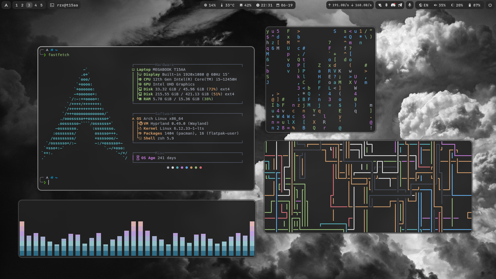

# Dotfiles



## Навигация

- [Установка](#установка)
- [Обзор риса](#обзор-риса)
  - [Yay](#yay) - помощник для установки пакетов из AUR
  - [Hyprland](#hyprland) - оконный менеджер
    - [Доп. пакеты](#дополнительные-пакеты) необходимые для корректной работы системы
    - [Бинды](#бинды) - все сочетания клавиш
    - [Иконки](#иконки) - пак иконок
    - [Курсор](#курсор) - тема курсора
    - [Шрифты](#шрифты) - установка шрифтов
    - [Hypridle](#hypridle) - поведение при бездействии
    - [Hyprlock](#hyprlock) - экран блокировки
  - [Waybar](#waybar) - wayland бар
  - [Rofi](#rofi) - запуск приложений, интерфейс для буфера обмена
  - [Wlogout](#wlogout) - блокировка экрана, выход, перезагрузка, выключение и т.д
  - [Fastfetch](#fastfetch) - похвастаться линуксом)
  - [Nwg-look](#nwg-look) - настройка GTK3
  - [Терминал](#терминал) - настройка терминала
  - [Swaync](#swaync) - уведомления
  - [Waypaper](#waypaper) - GUI для простого управление обоями
    - [Обои](#обои) - коллекция обоев/фонов
  - [Emote](#emote) - выбор эмодзи
  - [Flameshot](#flameshot) - мощная утилита для скриншотов

## Установка

```diff
+ Обновление системы и установка Git
sudo pacman -Syu git

+ Клонирование репозитория c конфигами
git clone https://github.com/retrilzzy/dotfiles.git ~/dotfiles && cd ~/dotfiles

+ Запуск скрипта установки пакетов
chmod +x ./Scripts/install_packages.sh
./Scripts/install_packages.sh

+ Копирование старых конфигов в отдельную директорию
mkdir -p ~/.config_backup
cp -r ~/.config ~/.config_backup/
cp ~/{.zshrc,.p10k.zsh,.nanorc} ~/.config_backup/ 2>/dev/null

+ Копирование новых конфигов из dotfiles
cp -r ~/dotfiles/Configs/.config/* ~/.config/
cp ~/dotfiles/Configs/.zshrc ~/dotfiles/Configs/.p10k.zsh ~/dotfiles/Configs/.nanorc ~/
```

## Обзор риса

## Yay

- Помощник для установки пакетов из AUR - [yay](https://github.com/Jguer/yay)

```
sudo pacman -S --needed git base-devel \
  && git clone https://aur.archlinux.org/yay.git \
  && cd yay && makepkg -si
```

## Hyprland

Оконный менеджер (WM)

- [[Основной конфиг](./Configs/.config/hypr/hyprland.conf)]
- [[Бинды](./Configs/.config/hypr/keybindings.conf)]
- [[Правила окон и рабочих столов](./Configs/.config/hypr/rules.conf)]

### Дополнительные пакеты

- Трей апплет для управления WiFi соединениями - [network-manager-applet](https://archlinux.org/packages/extra/x86_64/network-manager-applet/)
- Bluetooth - [bluez, bluez-tools, blueman](https://archlinux.org/packages/extra/x86_64/bluez/)
- Управления яркостью экрана - [brightnessctl](https://github.com/Hummer12007/brightnessctl)
- Копирование изображения в буфер обмена - [xdg-utils](https://archlinux.org/packages/extra/any/xdg-utils/)
- Скриншоты - [hyprshot](https://aur.archlinux.org/packages/hyprshot)

```
sudo pacman -S network-manager-applet \
  bluez bluez-tools blueman \
  brightnessctl xdg-utils wf-recorder grim \
  && yay -S hyprshot
```

### Бинды

#### Запуск приложений

| Клавиши                                            | Действие                            |
| :------------------------------------------------- | :---------------------------------- |
| <kbd>Super</kbd> + <kbd>W</kbd>                    | Терминал (Kitty)                    |
| <kbd>Super</kbd> + <kbd>Shift</kbd> + <kbd>W</kbd> | Терминал в плавающем режиме (float) |
| <kbd>Super</kbd> + <kbd>R</kbd>                    | Меню приложений (Rofi)              |
| <kbd>Super</kbd> + <kbd>E</kbd>                    | Файловый менеджер (Nautilus)        |
| <kbd>Super</kbd> + <kbd>C</kbd>                    | Редактор кода (VSCode)              |
| <kbd>Super</kbd> + <kbd>B</kbd>                    | Браузер (Brave)                     |
| <kbd>Super</kbd> + <kbd>K</kbd>                    | Менеджер паролей (Keepassxc)        |
| <kbd>Super</kbd> + <kbd>V</kbd>                    | Буфер обмена (Cliphist)             |
| <kbd>Super</kbd> + <kbd>N</kbd>                    | Центр уведомлений (Swaync)          |
| <kbd>Super</kbd> + <kbd>Shift</kbd> + <kbd>E</kbd> | Меню эмодзи (Emote)                 |
| <kbd>Super</kbd> + <kbd>Shift</kbd> + <kbd>P</kbd> | Управление обоями (Waypaper)        |

#### Взаимодействие с окнами

| Клавиши                                                    | Действие                                          |
| :--------------------------------------------------------- | :------------------------------------------------ |
| <kbd>Super</kbd> + <kbd>Q</kbd>                            | Закрыть активное окно                             |
| <kbd>Super</kbd> + <kbd>A</kbd>                            | Переключение на псевдоплиточный режим (pseudo)    |
| <kbd>Super</kbd> + <kbd>F</kbd>                            | Переключение окна в режим "плавающее" (float)     |
| <kbd>Super</kbd> + <kbd>S</kbd>                            | Закрепление окна поверх всех рабочих столов (pin) |
| <kbd>Super</kbd> + <kbd>D</kbd>                            | Переключение режима разделения окна               |
| <kbd>Alt</kbd> + <kbd>Tab</kbd>                            | Переключение на следующее окно                    |
| <kbd>Super</kbd> + <kbd>Стрелки</kbd>                      | Перемещение фокуса между окнами                   |
| <kbd>Super</kbd> + <kbd>Control</kbd> + <kbd>Стрелки</kbd> | Изменение размера активного окна                  |
| <kbd>Super</kbd> + <kbd>Shift</kbd> + <kbd>Стрелки</kbd>   | Перемещение окон                                  |
| <kbd>Super</kbd> + <kbd>ЛКМ</kbd>                          | Перемещение окон мышью                            |
| <kbd>Super</kbd> + <kbd>ПКМ</kbd>                          | Изменение размера окон мышью                      |

#### Рабочие пространства (столы)

| Клавиши                                                | Действие                                             |
| :----------------------------------------------------- | :--------------------------------------------------- |
| <kbd>Super</kbd> + <kbd>[0-9]</kbd>                    | Переключение между рабочими пространствами с 1 по 10 |
| <kbd>Super</kbd> + <kbd>Shift</kbd> + <kbd>[0-9]</kbd> | Перемещение окна в рабочее пространство с 1 по 10    |
| <kbd>Super</kbd> + <kbd>Tab</kbd>                      | Переключение на специальное рабочее пространство     |
| <kbd>Super</kbd> + <kbd>Shift</kbd> + <kbd>Tab</kbd>   | Перемещение окна в специальное рабочее пространство  |
| <kbd>Super</kbd> + <kbd>Колесо мыши</kbd>              | Переключение между рабочими пространствами           |

#### Управление экраном/питанием

| Клавиши                                          | Действие                                       |
| :----------------------------------------------- | :--------------------------------------------- |
| <kbd>Super</kbd> + <kbd>L</kbd>                  | Заблокировать экран                            |
| <kbd>Super</kbd> + <kbd>Alt</kbd> + <kbd>D</kbd> | Включить/выключить дисплей                     |
| <kbd>Super</kbd> + <kbd>Alt</kbd> + <kbd>S</kbd> | Заблокировать экран и перевести в спящий режим |

#### Скриншоты

| Клавиши                                                | Действие                                           |
| :----------------------------------------------------- | :------------------------------------------------- |
| <kbd>Print</kbd>                                       | Скриншот всего экрана                              |
| <kbd>Shift</kbd> + <kbd>Print</kbd>                    | Скриншот выделенной области                        |
| <kbd>Super</kbd> + <kbd>Print</kbd>                    | Скриншот выборного окна                            |
| <kbd>Super</kbd> + <kbd>Shift</kbd> + <kbd>F</kbd>     | Flameshot GUI (мощная утилита для скриншотов)      |
| <kbd>Super</kbd> + <kbd>Shift</kbd> + <kbd>Print</kbd> | Скриншот выделенной области и загрузка в Chibisafe |

#### Остальное

| Клавиши                                            | Действие                                   |
| :------------------------------------------------- | :----------------------------------------- |
| <kbd>Super</kbd> + <kbd>Escape</kbd>               | Скрыть/показать Waybar                     |
| <kbd>Super</kbd> +<kbd>Alt</kbd> + <kbd>P</kbd>    | Случайный фон из директории Wallpapers     |
| <kbd>Super</kbd> + <kbd>Shift</kbd> + <kbd>R</kbd> | Начать запись области экрана (wf-recorder) |

### Иконки

https://github.com/PapirusDevelopmentTeam/papirus-icon-theme

```
sudo pacman -S papirus-icon-theme
```

### Курсор

https://github.com/rose-pine/cursor

https://github.com/ndom91/rose-pine-hyprcursor

```
yay -S rose-pine-cursor rose-pine-hyprcursor
```

### Шрифты

Поддержка всех символов

```
sudo pacman -S noto-fonts noto-fonts-emoji noto-fonts-cjk noto-fonts-extra
```

Шрифт для VSCode

```
sudo pacman -S ttf-jetbrains-mono-nerd
```

Шрифт для терминала

```
yay -S ttf-meslo-nerd-font-powerlevel10k
```

### Hypridle

Поведение при бездействии [[конфиг](./Configs/.config/hypr/hypridle.conf)]

```
sudo pacman -S hypridle
```

| Действие          | Таймаут   |
| ----------------- | --------- |
| Снижение яркости  | 5 мин.    |
| Блокировка экрана | 10 мин.   |
| Выключение экрана | 10.2 мин. |
| Спящий режим      | 20 мин.   |

### Hyprlock

Экран блокировки [[конфиг](./Configs/.config/hypr/hyprlock.conf)]

_в конфиге надо поменять путь к изображению_

```
sudo pacman -S hyprlock
```

<details><summary><b>Скриншот</b></summary>


</details>

## Waybar

Wayland бар [[конфиг](./Configs/.config/waybar/)]

```
sudo pacman -S waybar
```

<details><summary><b>Скриншот</b></summary>


</details>

## Rofi

Запуск приложений, интерфейс для буфера обмена [[конфиг](./Configs/.config/rofi/)]

```
sudo pacman -S rofi wl-clipboard cliphist
```

<details><summary><b>Скриншот (Лаунчер приложений)</b></summary>


</details>

<details><summary><b>Скриншот (Буфер обмена)</b></summary>


</details>

## Wlogout

Блокировка экрана, выход, перезагрузка, выключение и т.д. [[конфиг](./Configs/.config/wlogout/)]

```
yay -S wlogout
```

<details><summary><b>Скриншот</b></summary>


</details>

## Терминал

Эмулятор терминала - [Kitty](https://sw.kovidgoyal.net/kitty) [[конфиг](./Configs/.config/kitty/)]

Оболочка - [Zsh](https://www.zsh.org/) [[конфиг](./Configs/.config/.zshrc)]

Расширение для Zsh - [Oh My Zsh](https://github.com/ohmyzsh/ohmyzsh)

Тема - [powerlevel10k](https://github.com/romkatv/powerlevel10k) [[конфиг](./Configs/.config/.p10k.zsh)]

<details><summary><b>Скриншот</b></summary>


</details><br>

Установка kitty и zsh

```
sudo pacman -S kitty zsh
```

Установка Oh My Zsh

```
sh -c "$(curl -fsSL https://raw.githubusercontent.com/ohmyzsh/ohmyzsh/master/tools/install.sh)"
```

Установка темы powerlevel10k

```
git clone --depth=1 https://github.com/romkatv/powerlevel10k.git ${ZSH_CUSTOM:-$HOME/.oh-my-zsh/custom}/themes/powerlevel10k
```

Установка плагинов для zsh через Oh My Zsh:

- [zsh-syntax-highlighting](https://github.com/zsh-users/zsh-syntax-highlighting)

```
git clone https://github.com/zsh-users/zsh-syntax-highlighting.git ${ZSH_CUSTOM:-~/.oh-my-zsh/custom}/plugins/zsh-syntax-highlighting
```

- [zsh-autosuggestions](https://github.com/zsh-users/zsh-autosuggestions)

```
git clone https://github.com/zsh-users/zsh-autosuggestions ${ZSH_CUSTOM:-~/.oh-my-zsh/custom}/plugins/zsh-autosuggestions
```

Установка [exa](https://github.com/ogham/exa) (замена ls)

```
sudo pacman -S exa
```

Установка [The F\*ck](https://github.com/nvbn/thefuck) (корректировщик предыдущих команд в терминале)

```
sudo pacman -S thefuck
```

## Fastfetch

Похвастаться линуксом) [[конфиг](./Configs/.config/fastfetch/)]

```
sudo pacman -S fastfetch
```

<details><summary><b>Скриншот</b></summary>


</details>

## Nwg-look

Настройка GTK3 [[конфиг](./Configs/.config/nwg-look/)]

```
sudo pacman -S nwg-look
```

**Темная тема Adwaita**

`~/.themes/Adwaita-Dark/gtk-3.0/gtk.css`

```
@import url("resource:///org/gtk/libgtk/theme/Adwaita/gtk-contained-dark.css");
```

## SwayNC

Уведомления [[конфиг](./Configs/.config/swaync/)]

```
sudo pacman -S swaync
```

## Waypaper

GUI для простого управление обоями

```
yay -S waypaper
```

Для статичных изображений и gif

```
sudo pacman -S swww
```

Для видео

```
sudo pacman -S mpvpaper
```

### Обои

- [Монохром](https://share.rzx.ovh/folder/cm8q1lxwp000mln01qsqbpb7f)
- Возможно будут еще...

## Emote

Выбор эмодзи

```
yay -S emote
```

## Flameshot

Мощная утилита для скриншотов [[конфиг](./Configs/.config/flameshot/)]

```
sudo pacman -S flameshot
```

<details><summary><b>Скриншот</b></summary>


</details>
