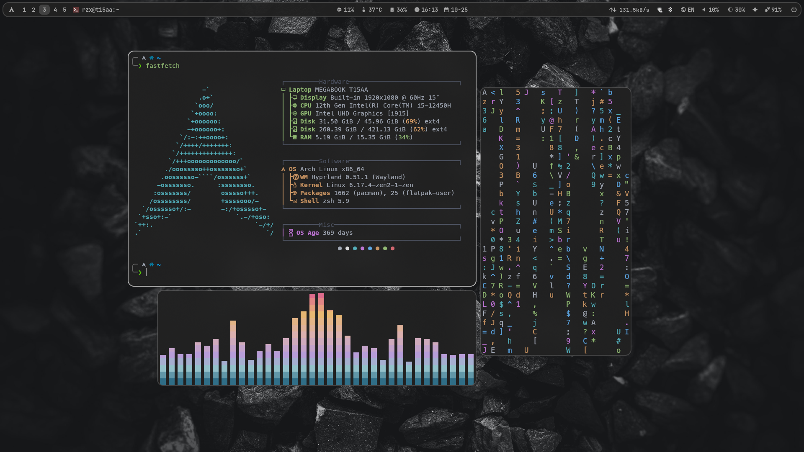
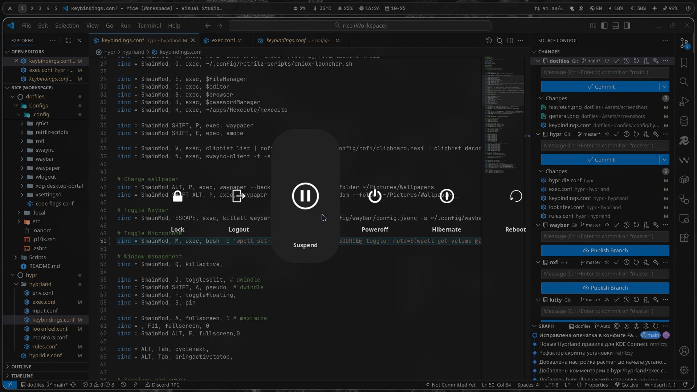

# Dotfiles

<table>
  <tr>
    <td colspan="3" align="center">
      <br>
    </td>
  </tr>
  <tr>
    <td align="center">
      <br>
      <sub>Hyprlock</sub>
    </td>
    <td align="center">
      <br>
      <sub>Rofi</sub>
    </td>
    <td align="center">
      <br>
      <sub>Kitty</sub>
    </td>
  </tr>
</table>

# Навигация

- [Установка](#установка)
- [Детальный обзор](#детальный-обзор)
  - [Доп. пакеты](#дополнительные-пакеты) необходимые для полноценной работы
  - [Hyprland](#hyprland) - оконный менеджер
    - [Бинды](#бинды) - все сочетания клавиш
    - [Иконки](#иконки) - пак иконок
    - [Курсор](#курсор) - тема курсора
    - [Шрифты](#шрифты) - установка шрифтов
    - [Hypridle](#hypridle) - поведение при бездействии
    - [Hyprlock](#hyprlock) - экран блокировки
  - [Waybar](#waybar) - wayland бар
  - [Rofi](#rofi) - запуск приложений, интерфейс для буфера обмена
  - [Wlogout](#wlogout) - блокировка экрана, выход, перезагрузка, выключение и т.д
  - [Nwg-look](#nwg-look) - настройка GTK
  - [Qt5/Qt6](#qt5-qt6) - настройка Qt5 и Qt6
  - [Терминал](#терминал) - настройка терминала
  - [Swaync](#swaync) - уведомления
  - [Waypaper](#waypaper) - GUI для простого управление обоями
    - [Обои](#обои) - коллекция обоев/фонов
  - [Emote](#emote) - выбор эмодзи
  - [Flameshot](#flameshot) - мощная утилита для скриншотов
  - [Fastfetch](#fastfetch) - похвастаться линуксом)

> [!WARNING]  
> Мои конфиги не рассчитаны на универсальное применение и не автоматизированы на 100%, поэтому они могут потребовать ручной донастройки. Я не гарантирую корректную работу конфигов или программного обеспечения на вашей системе.

# Установка

> [!NOTE]
> Перед установкой у вас должен быть работающий Hyprland.

0. Обновление системы:

   ```
   sudo pacman -Syu
   ```

1. Запуск скрипта установки:

   ```
   curl https://raw.githubusercontent.com/retrilzzy/dotfiles/refs/heads/main/Scripts/install.sh | bash
   ```

   - Установка пакетов.
   - Клонирование репозитория в `~/dotfiles`.
   - Резервное копирование текущих конфигов в `~/.config-backups/$date_time`.
   - Применение конфигов.

## После установки

Действия которые вы вероятно хотите сделать.

**Общее:**

- Запустить nwg-look (GTK Settings) для настройки GTK.
- Запустить Qt5ct и Qt6ct для настройки Qt5 и Qt6.
- Добавить свои обои в ~/Pictures/Wallpapers.
- Запустить `p10k configure` для настройки темы терминала.
- Убрать лишние для вас плагины Zsh в `~/.zshrc`:
  ```zsh
  plugins=(...)
  ```

**ПК юзерам:**

- Отключить модуль `custom/backlight` waybar в `~/.config/waybar/config.jsonc`.

## Восстановление резервной копии конфигов

```
~/dotfiles/Scripts/restore.sh
```

# Детальный обзор

## Дополнительные пакеты

Используемые в биндах hyprland и модулях waybar, a также для улучшения опыта использования.

> [!NOTE]
> Исключения из списка: пакеты которые подробнее упомянуты в этом README.md и программы по типу браузеров, терминалов и т.д.

- Помощник для установки пакетов из AUR - [yay](https://github.com/Jguer/yay)

  ```
  sudo pacman -S --needed git base-devel \
   && git clone https://aur.archlinux.org/yay.git \
   && cd yay && makepkg -si
  ```

- blueman
- brightnessctl
- cliphist
- gnome-bluetooth-3.0
- hyprshot
- network-manager-applet
- networkmanager
- pipewire
- pipewire-pulse
- pipewire-alsa
- pipewire-audio
- pipewire-jack
- playerctl
- polkit-gnome-authentication-agent
- power-profile-daemon
- wl-clip-persist
- wf-recorder
- xdg-utils
- xdg-desktop-portal
- xdg-desktop-portal-hyprland
- xdg-desktop-portal-gtk
- xdg-desktop-portal-wlr

## Hyprland

Оконный менеджер (WM).

- [[Основной конфиг](./Configs/.config/hypr/hyprland.conf)]
- [[Бинды](./Configs/.config/hypr/keybindings.conf)]
- [[Правила окон и рабочих столов](./Configs/.config/hypr/rules.conf)]

## Бинды

<details>
   <summary>
      <b>Запуск приложений</b>
   </summary>

| Клавиши                                            | Действие                                 |
| :------------------------------------------------- | :--------------------------------------- |
| <kbd>Super</kbd> + <kbd>W</kbd>                    | Терминал (Kitty)                         |
| <kbd>Super</kbd> + <kbd>Shift</kbd> + <kbd>W</kbd> | Терминал в плавающем режиме (float)      |
| <kbd>Super</kbd> + <kbd>R</kbd>                    | Меню приложений (Rofi)                   |
| <kbd>Super</kbd> + <kbd>R</kbd>                    | Меню приложений с запуском через Oniux\* |
| <kbd>Super</kbd> + <kbd>E</kbd>                    | Файловый менеджер (Nautilus)             |
| <kbd>Super</kbd> + <kbd>C</kbd>                    | Редактор кода (VSCode)                   |
| <kbd>Super</kbd> + <kbd>B</kbd>                    | Браузер (Brave)                          |
| <kbd>Super</kbd> + <kbd>K</kbd>                    | Менеджер паролей (Keepassxc)             |
| <kbd>Super</kbd> + <kbd>V</kbd>                    | Буфер обмена (Cliphist)                  |
| <kbd>Super</kbd> + <kbd>N</kbd>                    | Центр уведомлений (Swaync)               |
| <kbd>Super</kbd> + <kbd>Shift</kbd> + <kbd>E</kbd> | Меню эмодзи (Emote)                      |
| <kbd>Super</kbd> + <kbd>Shift</kbd> + <kbd>P</kbd> | Управление обоями (Waypaper)             |

\*Oniux - https://blog.torproject.org/introducing-oniux-tor-isolation-using-linux-namespaces/

</details>

<details>
   <summary>
      <b>Взаимодействие с окнами</b>
   </summary>

| Клавиши                                                    | Действие                                          |
| :--------------------------------------------------------- | :------------------------------------------------ |
| <kbd>Super</kbd> + <kbd>Q</kbd>                            | Закрыть активное окно                             |
| <kbd>Super</kbd> + <kbd>A</kbd>                            | Переключение на псевдоплиточный режим (pseudo)    |
| <kbd>Super</kbd> + <kbd>F</kbd>                            | Переключение окна в режим "плавающее" (float)     |
| <kbd>Super</kbd> + <kbd>S</kbd>                            | Закрепление окна поверх всех рабочих столов (pin) |
| <kbd>Super</kbd> + <kbd>D</kbd>                            | Переключение режима разделения окна               |
| <kbd>Alt</kbd> + <kbd>Tab</kbd>                            | Переключение на следующее окно                    |
| <kbd>Super</kbd> + <kbd>Стрелки</kbd>                      | Перемещение фокуса между окнами                   |
| <kbd>Super</kbd> + <kbd>Control</kbd> + <kbd>Стрелки</kbd> | Изменение размера активного окна                  |
| <kbd>Super</kbd> + <kbd>Shift</kbd> + <kbd>Стрелки</kbd>   | Перемещение окон                                  |
| <kbd>Super</kbd> + <kbd>ЛКМ</kbd>                          | Перемещение окон мышью                            |
| <kbd>Super</kbd> + <kbd>ПКМ</kbd>                          | Изменение размера окон мышью                      |

</details>

<details>
   <summary>
      <b>Рабочие пространства (столы)</b>
   </summary>

| Клавиши                                                | Действие                                             |
| :----------------------------------------------------- | :--------------------------------------------------- |
| <kbd>Super</kbd> + <kbd>[0-9]</kbd>                    | Переключение между рабочими пространствами с 1 по 10 |
| <kbd>Super</kbd> + <kbd>Shift</kbd> + <kbd>[0-9]</kbd> | Перемещение окна в рабочее пространство с 1 по 10    |
| <kbd>Super</kbd> + <kbd>Tab</kbd>                      | Переключение на специальное рабочее пространство     |
| <kbd>Super</kbd> + <kbd>Shift</kbd> + <kbd>Tab</kbd>   | Перемещение окна в специальное рабочее пространство  |
| <kbd>Super</kbd> + <kbd>Колесо мыши</kbd>              | Переключение между рабочими пространствами           |

</details>

<details>
   <summary>
      <b> Управление экраном/питанием</b>
   </summary>

| Клавиши                                          | Действие                                       |
| :----------------------------------------------- | :--------------------------------------------- |
| <kbd>Super</kbd> + <kbd>L</kbd>                  | Заблокировать экран                            |
| <kbd>Super</kbd> + <kbd>Alt</kbd> + <kbd>D</kbd> | Включить/выключить дисплей                     |
| <kbd>Super</kbd> + <kbd>Alt</kbd> + <kbd>S</kbd> | Заблокировать экран и перевести в спящий режим |

</details>

<details>
   <summary>
      <b>Скриншоты</b>
   </summary>

| Клавиши                                            | Действие                                                         |
| :------------------------------------------------- | :--------------------------------------------------------------- |
| <kbd>Print</kbd>                                   | Скриншот всего экрана                                            |
| <kbd>Shift</kbd> + <kbd>Print</kbd>                | Скриншот выделенной области                                      |
| <kbd>Super</kbd> + <kbd>Shift</kbd> + <kbd>F</kbd> | Flameshot GUI (мощная утилита для скриншотов)                    |
| <kbd>Super</kbd> + <kbd>Print</kbd>                | Скриншот и авто загрузка на [Zipline](https://zipline.diced.sh/) |

</details>

<details>
   <summary>
      <b>Остальное</b>
   </summary>

| Клавиши                                            | Действие                                   |
| :------------------------------------------------- | :----------------------------------------- |
| <kbd>Super</kbd> + <kbd>Escape</kbd>               | Скрыть/показать Waybar                     |
| <kbd>Super</kbd> +<kbd>Alt</kbd> + <kbd>P</kbd>    | Случайный фон из директории Wallpapers     |
| <kbd>Super</kbd> + <kbd>Shift</kbd> + <kbd>R</kbd> | Начать запись области экрана (wf-recorder) |
| <kbd>Super</kbd> + <kbd>M</kbd>                    | Включение/выключение микрофона             |

</details>

## Иконки

https://github.com/PapirusDevelopmentTeam/papirus-icon-theme

```
sudo pacman -S papirus-icon-theme
```

## Курсор

https://github.com/rose-pine/cursor

https://github.com/ndom91/rose-pine-hyprcursor

```
yay -S rose-pine-cursor rose-pine-hyprcursor
```

## Шрифты

- [Noto](https://www.google.com/get/noto/) - поддержка всех языков + эмодзи + специальные символы:

  ```
  sudo pacman -S noto-fonts noto-fonts-emoji noto-fonts-cjk noto-fonts-extra
  ```

- [JetBrains Mono Nerd](https://www.jetbrains.com/lp/mono/) для VSCode и [Waybar](#waybar):

  ```
  sudo pacman -S ttf-jetbrains-mono-nerd
  ```

- [Meslo Nerd](https://github.com/romkatv/powerlevel10k?tab=readme-ov-file#fonts) рекомендуемый шрифт для powerlevel10k (Zsh тема):

  ```
  yay -S ttf-meslo-nerd-font-powerlevel10k
  ```

- [Inter](https://rsms.me/inter/) необходимый шрифт для [Hyprlock](#hyprlock):

  ```
  sudo pacman -S inter-font
  ```

## Hypridle

Поведение при бездействии. [[конфиг](./Configs/.config/hypr/hypridle.conf)]

https://wiki.hypr.land/Hypr-Ecosystem/hypridle |
https://github.com/hyprwm/hypridle

```
sudo pacman -S hypridle
```

| Действие          | Таймаут |
| ----------------- | ------- |
| Снижение яркости  | 10 мин. |
| Уведомление       | 13 мин. |
| Блокировка сессии | 15 мин. |
| Выключение экрана | 16 мин. |
| Спящий режим      | 18 мин. |

## Hyprlock

Экран блокировки. [[конфиг](./Configs/.config/hypr/hyprlock.conf)]

https://github.com/hyprwm/hyprlock

```
sudo pacman -S hyprlock
```

<details><summary><b>Скриншот</b></summary>


</details>

## Waybar

Wayland бар. [[конфиг](./Configs/.config/waybar/)]

https://github.com/Alexays/Waybar

```
sudo pacman -S waybar
```

<details><summary><b>Скриншот</b></summary>


</details>

## Rofi

Запуск приложений, интерфейс для буфера обмена. [[конфиг](./Configs/.config/rofi/)]

https://github.com/davatorium/rofi

```
sudo pacman -S rofi wl-clipboard cliphist
```

<details><summary><b>Скриншот (Лаунчер приложений)</b></summary>


</details>

<details><summary><b>Скриншот (Буфер обмена)</b></summary>


</details>

## Wlogout

Блокировка экрана, выход, перезагрузка, выключение и т.д. [[конфиг](./Configs/.config/wlogout/)]

https://github.com/ArtsyMacaw/wlogout

```
yay -S wlogout
```

<details><summary><b>Скриншот</b></summary>



</details>

## Терминал

Эмулятор терминала - [Kitty](https://sw.kovidgoyal.net/kitty). [[конфиг](./Configs/.config/kitty/)]

Оболочка - [Zsh](https://www.zsh.org/). [[конфиг](./Configs/.zshrc)]

Расширение для Zsh - [Oh My Zsh](https://github.com/ohmyzsh/ohmyzsh).

Тема - [powerlevel10k](https://github.com/romkatv/powerlevel10k). [[конфиг](./Configs/.p10k.zsh)]

<details><summary><b>Скриншот</b></summary>


</details><br>

Установка Kitty и Zsh:

```
sudo pacman -S kitty zsh
```

Смена оболочки:

```
chsh -s $(which zsh)
```

Установка Oh My Zsh:

```
sh -c "$(curl -fsSL https://raw.githubusercontent.com/ohmyzsh/ohmyzsh/master/tools/install.sh)"
```

Установка темы powerlevel10k:

```
git clone --depth=1 https://github.com/romkatv/powerlevel10k.git ${ZSH_CUSTOM:-$HOME/.oh-my-zsh/custom}/themes/powerlevel10k
```

Установка плагинов для zsh через Oh My Zsh:

- [zsh-syntax-highlighting](https://github.com/zsh-users/zsh-syntax-highlighting):

```
git clone https://github.com/zsh-users/zsh-syntax-highlighting.git ${ZSH_CUSTOM:-~/.oh-my-zsh/custom}/plugins/zsh-syntax-highlighting
```

- [zsh-autosuggestions](https://github.com/zsh-users/zsh-autosuggestions):

```
git clone https://github.com/zsh-users/zsh-autosuggestions ${ZSH_CUSTOM:-~/.oh-my-zsh/custom}/plugins/zsh-autosuggestions
```

Установка [lsd](https://github.com/lsd-rs/lsd) (замена ls):

```
sudo pacman -S lsd
```

## Nwg-look

Настройка GTK. [[конфиг](./Configs/.config/nwg-look/)]

https://github.com/nwg-piotr/nwg-look

```
sudo pacman -S nwg-look
```

**Дефолтная темная тема**

```
> ~/.themes/Adwaita-Dark/gtk-3.0/gtk.css

@import url("resource:///org/gtk/libgtk/theme/Adwaita/gtk-contained-dark.css");
```

```
gsettings set org.gnome.desktop.interface color-scheme prefer-dark
gsettings set org.gnome.desktop.interface gtk-theme Adwaita-dark
```

## Qt5 Qt6

Настройка Qt5. [[конфиг](./Configs/.config/qt5ct/)]

Настройка Qt6. [[конфиг](./Configs/.config/qt6ct/)]

https://sourceforge.net/projects/qt5ct/
https://www.opencode.net/trialuser/qt6ct

```
sudo pacman -S qt5ct qt6ct
```

## SwayNC

Уведомления. [[конфиг](./Configs/.config/swaync/)]

https://github.com/ErikReider/SwayNotificationCenter

```
sudo pacman -S swaync
```

<details><summary><b>Скриншоты</b></summary>


<br>


</details>

## Waypaper

GUI для простого управление обоями.

https://github.com/anufrievroman/waypaper

```
yay -S waypaper
```

Для статичных изображений и gif (необходим):

```
sudo pacman -S swww
```

Для видео (опционально):

```
sudo pacman -S mpvpaper
```

### Обои

- [Монохром](https://share.rzx.ovh/folder/cm8q1lxwp000mln01qsqbpb7f)
- Возможно будут еще...

## Emote

Выбор эмодзи.

https://github.com/tom-james-watson/Emote

```
yay -S emote
```

## Flameshot

Мощная утилита для скриншотов. [[конфиг](./Configs/.config/flameshot/)]

https://flameshot.org

```
sudo pacman -S flameshot
```

<details><summary><b>Скриншот</b></summary>


</details>

## Fastfetch

Похвастаться линуксом) [[конфиг](./Configs/.config/fastfetch/)]

https://github.com/fastfetch-cli/fastfetch

```
sudo pacman -S fastfetch
```

<details><summary><b>Скриншот</b></summary>


</details>
