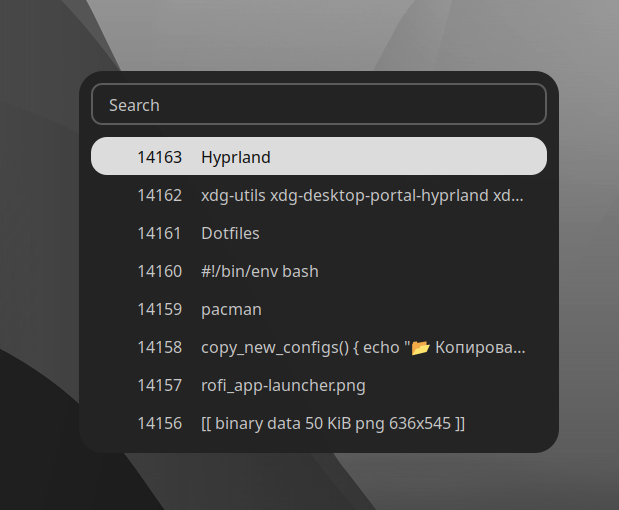
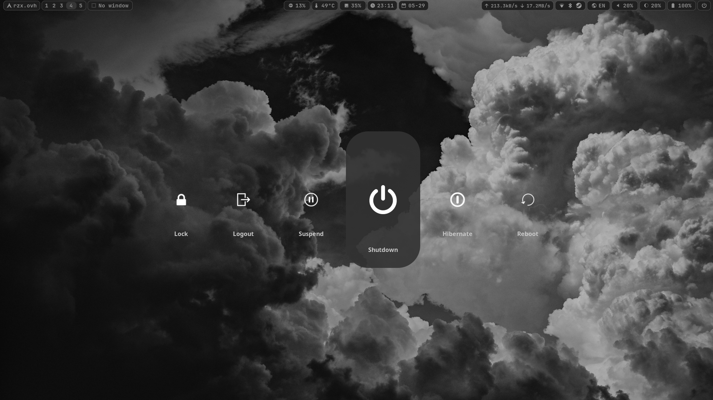
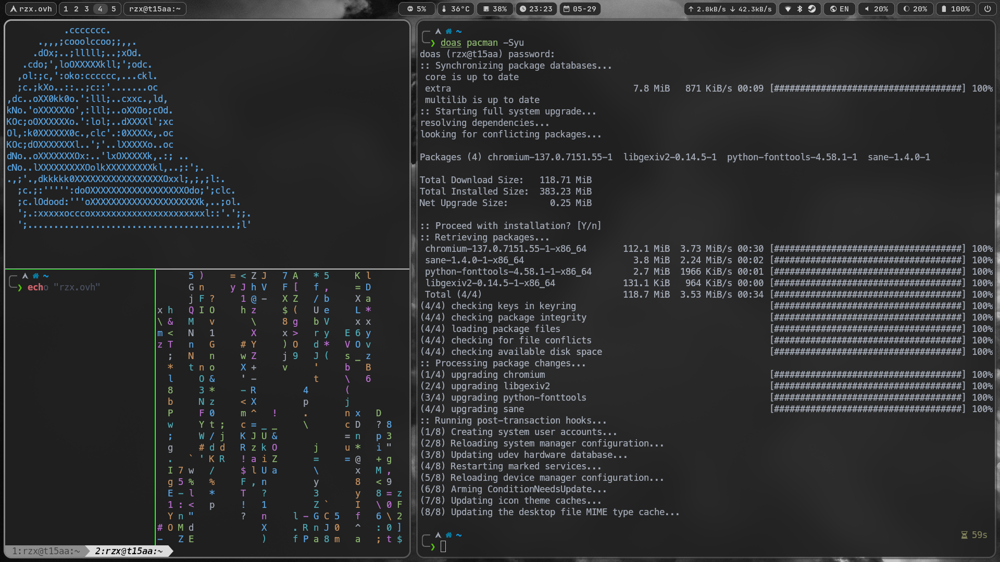

# Dotfiles


## Навигация
- [Hyprland](#hyprland)
    - [Hyprpaper](#hyprpaper)
    - [Hyprlock](#hyprlock)
- [Waybar](#waybar)
- [Rofi](#rofi)
- [Wlogout](#wlogout)
- [Терминал](#терминал)
- [Дополнительные пакеты](#дополнительные-пакеты)


## Hyprland

Оконный менеджер (WM) [[конфиг](./Configs/hypr/)]

```
sudo pacman -S hyprland hyprpaper hyprlock
```

- [[Основной конфиг](./Configs/hypr/hyprland.conf)]
- [[Бинды](./Configs/hypr/keybindings.conf)]


### Hyprpaper

Установка обоев [[конфиг](./Configs/hypr/hyprpaper.conf)]

### Hyprlock

Блокировка экрана [[конфиг](./Configs/hypr/hyprlock.conf)]


<details><summary><b>Скриншот</b></summary>


</details>


## Waybar

Wayland бар [[конфиг](./Configs/waybar/)]


```
sudo pacman -S waybar
```

<details><summary><b>Скриншот</b></summary>


</details>


## Rofi

Запуск приложений, интерфейс для буфера обмена и Wi-Fi [[конфиг](./Configs/rofi/)]


```
sudo pacman -S rofi networkmanager wl-clipboard cliphist
```

<details><summary><b>Скриншот (Лаунчер приложений)</b></summary>


</details>

<details><summary><b>Скриншот (Буфер обмена)</b></summary>


</details>

<details><summary><b>Скриншот (Wi-Fi)</b></summary>


</details>


## Wlogout
Блокировка экрана, выход, перезагрузка, выключение и т.д. [[конфиг](./Configs/wlogout/)]

<details><summary><b>Скриншот</b></summary>


</details>


## Терминал
Эмулятор терминала - [Kitty](https://sw.kovidgoyal.net/kitty) [[конфиг](./Configs/kitty/)]

Оболочка - [Zsh](https://www.zsh.org/) [[конфиг](./Configs/.zshrc)]

Расширение для Zsh - [Oh My Zsh](https://github.com/ohmyzsh/ohmyzsh)

Тема - [powerlevel10k](https://github.com/romkatv/powerlevel10k) [[конфиг](./Configs/.p10k.zsh)]

<details><summary><b>Скриншот</b></summary>


</details><br>

Установка kitty и zsh
```
sudo pacman -S kitty zsh
```
Установка Oh My Zsh
```
sh -c "$(curl -fsSL https://raw.githubusercontent.com/ohmyzsh/ohmyzsh/master/tools/install.sh)"
```
Установка темы powerlevel10k
```
git clone --depth=1 https://github.com/romkatv/powerlevel10k.git ${ZSH_CUSTOM:-$HOME/.oh-my-zsh/custom}/themes/powerlevel10k
```

Установка плагинов для zsh через Oh My Zsh:

- [zsh-syntax-highlighting](https://github.com/zsh-users/zsh-syntax-highlighting)
```
git clone https://github.com/zsh-users/zsh-syntax-highlighting.git ${ZSH_CUSTOM:-~/.oh-my-zsh/custom}/plugins/zsh-syntax-highlighting
```

- [zsh-autosuggestions](https://github.com/zsh-users/zsh-autosuggestions)
```
git clone https://github.com/zsh-users/zsh-autosuggestions ${ZSH_CUSTOM:-~/.oh-my-zsh/custom}/plugins/zsh-autosuggestions
```

Установка [exa](https://github.com/ogham/exa) (замена ls)
```
sudo pacman -S exa
```

Установка [The F*ck](https://github.com/nvbn/thefuck) (корректировщик предыдущих команд в терминале)
```
sudo pacman -S thefuck
```


## Дополнительные пакеты

Управления яркостью экрана - [brightnessctl](https://github.com/Hummer12007/brightnessctl)

Копирование изображения в буфер обмена - [xdg-utils](https://archlinux.org/packages/?name=xdg-utils)


<br><hr>
*PS: это мои первые конфиги для оконных менеджеров в общем.*
